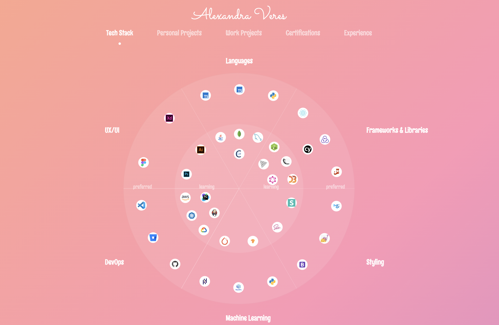

 

  <h1 align="center">Portfolio</h1>

  

    A React TypeScript application showcasing my experience and the projects I worked on.
     
     
    <a href="https://www.sandraveres.studio/">www.sandraveres.studio</a> 
  

